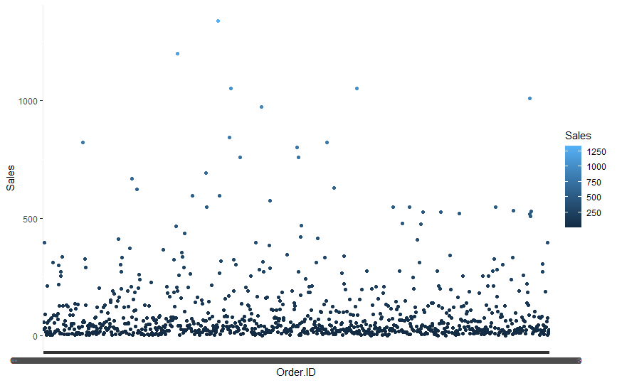
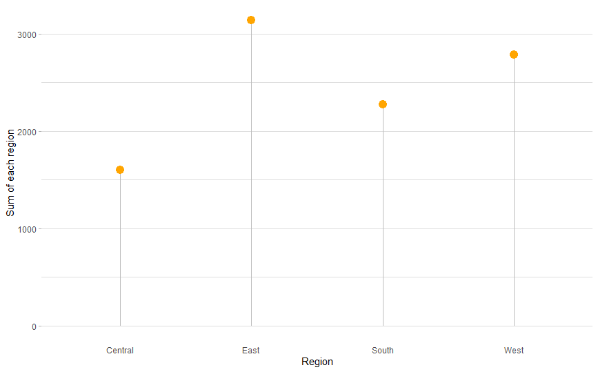

# R-Assignment 4

**Created by Nattakorn Chotpattarajinda (ID: 63130500029)**

Choose Dataset:
2. Superstore Sales Dataset (Data from Rohit Sahoo,[Kaggle](https://www.kaggle.com/rohitsahoo/sales-forecasting)) >> [Using CSV](https://raw.githubusercontent.com/safesit23/INT214-Statistics/main/datasets/superstore_sales.csv)


### Outlines
1. Explore the dataset
2. Learning function from Tidyverse
3. Transform data with dplyr and finding insight the data
4. Visualization with GGplot2

## Part 1: Explore the dataset

```
#Library
library(dplyr)
library(readr)
library(stringr)
library(ggplot2)

#Dataset
store <- read_csv("https://raw.githubusercontent.com/safesit23/INT214-Statistics/main/datasets/superstore_sales.csv")

#Explore Dataset
View(store)
#or
glimpse(store)
```

In this dataset have 9800 rows and 18 columns in the superstore dataset
```
$ `Row ID`        <dbl> 1, 2, 3, 4, 5, 6, 7, 8, 9, 10, 11, 12, 13, 14, 15, 16, 17, 18, 19, 20, 21, 22, 23, 24, 25, 26, ~
$ `Order ID`      <chr> "CA-2017-152156", "CA-2017-152156", "CA-2017-138688", "US-2016-108966", "US-2016-108966", "CA-2~
$ `Order Date`    <chr> "08/11/2017", "08/11/2017", "12/06/2017", "11/10/2016", "11/10/2016", "09/06/2015", "09/06/2015~
$ `Ship Date`     <chr> "11/11/2017", "11/11/2017", "16/06/2017", "18/10/2016", "18/10/2016", "14/06/2015", "14/06/2015~
$ `Ship Mode`     <chr> "Second Class", "Second Class", "Second Class", "Standard Class", "Standard Class", "Standard C~
$ `Customer ID`   <chr> "CG-12520", "CG-12520", "DV-13045", "SO-20335", "SO-20335", "BH-11710", "BH-11710", "BH-11710",~
$ `Customer Name` <chr> "Claire Gute", "Claire Gute", "Darrin Van Huff", "Sean O'Donnell", "Sean O'Donnell", "Brosina H~
$ Segment         <chr> "Consumer", "Consumer", "Corporate", "Consumer", "Consumer", "Consumer", "Consumer", "Consumer"~
$ Country         <chr> "United States", "United States", "United States", "United States", "United States", "United St~
$ City            <chr> "Henderson", "Henderson", "Los Angeles", "Fort Lauderdale", "Fort Lauderdale", "Los Angeles", "~
$ State           <chr> "Kentucky", "Kentucky", "California", "Florida", "Florida", "California", "California", "Califo~
$ `Postal Code`   <dbl> 42420, 42420, 90036, 33311, 33311, 90032, 90032, 90032, 90032, 90032, 90032, 90032, 28027, 9810~
$ Region          <chr> "South", "South", "West", "South", "South", "West", "West", "West", "West", "West", "West", "We~
$ `Product ID`    <chr> "FUR-BO-10001798", "FUR-CH-10000454", "OFF-LA-10000240", "FUR-TA-10000577", "OFF-ST-10000760", ~
$ Category        <chr> "Furniture", "Furniture", "Office Supplies", "Furniture", "Office Supplies", "Furniture", "Offi~
$ `Sub-Category`  <chr> "Bookcases", "Chairs", "Labels", "Tables", "Storage", "Furnishings", "Art", "Phones", "Binders"~
$ `Product Name`  <chr> "Bush Somerset Collection Bookcase", "Hon Deluxe Fabric Upholstered Stacking Chairs, Rounded Ba~
$ Sales           <dbl> 261.9600, 731.9400, 14.6200, 957.5775, 22.3680, 48.8600, 7.2800, 907.1520, 18.5040, 114.9000, 1~
```

## Part 2: Learning function from Tidyverse

-Package [stringr](https://stringr.tidyverse.org/reference/str_detect.html) function ```str_subset(x, pattern)``` is used for extracts the matching components.
```
emotion <- c("happy", "sad", "boring")
str_length(emotion)
# [1] 5 3 6
str_subset(emotion, "[sr]")
#> [1] "sad" "boring"
```

-Package [lubridate](https://lubridate.tidyverse.org/reference/ymd.html) function ```ymd()``` and ```dmy()``` is used for convert numeric into date, Even with different number formats
```
ymd(20010404)
#> [1] "2001-04-04"
mdy("4/4/44")
#> [1] "2044-04-04"
```
## Part 3: Transform data with dplyr and finding insight the data

## 1.Find Customer ID that bought technology category

```
tech <- store %>% filter(store$Category == "Technology")
tech %>% distinct(tech$Customer.ID)
```

Result:
```
tech$Customer.ID
1           BH-11710
2           ZD-21925
3           EH-13945
4           GH-14485
5           SN-20710
6           LC-16930
7           ON-18715
8           LH-16900
9           JM-15265
10          TB-21055
...684
```

Explain:
- กรองโดยใช้ Filter หาประเภทของสินค้าที่เป็น Technology
- เอาข้อมูลที่ได้มาใส่ในตัวแปร tech แล้วแสดงข้อมูลที่ไม่ซ้ำกันของ customer id

## 2.Find the name of the customer has the most sales

```
store %>% select(Customer.Name,Sales) %>%
  group_by(Customer.Name) %>% summarise(sumSales = sum(Sales)) %>%
  slice_max(sumSales)
```

Result:
```
  Customer.Name sumSales
  <chr>            <dbl>
1 Sean Miller     25043.
```

## 3.Find furniture that has sales less than 1000 and count the order.

```
store %>% filter(store$Sales < 1000 & store$Category == 'Furniture') %>% count() %>% rename(SaleLessThan1000 = n)
```

Result:
```
  SaleLessThan1000
1             1911
```

## 4.Find number of customer who live in west side.

```
store %>% select(Customer.ID,Region) %>% filter(Region == 'West') %>% count() %>% rename(numberOfWestCustomer = n)
```

Result:
```
  numberOfWestCustomer
1                 3140
```

## 5.Find customer name that bought the lowest price.

```
store %>% select(Customer.Name,Sales) %>% slice_min(Sales)
```

Result:
```
     Customer.Name Sales
1 Zuschuss Carroll 0.444
```

## 6.Find 10 customer name that bought the highest price.

```
store %>% select(Customer.Name,Sales) %>% slice_max(Sales , n=10 )
```

Result:
```
        Customer.Name     Sales
1         Sean Miller 22638.480
2        Tamara Chand 17499.950
3        Raymond Buch 13999.960
4        Tom Ashbrook 11199.968
5        Hunter Lopez 10499.970
6       Adrian Barton  9892.740
7        Sanjit Chand  9449.950
8        Bill Shonely  9099.930
9        Sanjit Engle  8749.950
10 Christopher Conant  8399.976
```

## Part 4: Visualization with GGplot2
## 1.This graph's show price of furnishing that's subcategory in each order

```
# Filter subcategory equal Furnishings and set x to be orderID and y to be Sales
scat_plot <- store %>% filter(Sub.Category == 'Furnishings') %>% ggplot(aes(x=Order.ID,y=Sales))+
  geom_point(aes(color=Sales))
scat_plot
```
Result:



## 2.This graph is about counting region in this dataset
```
# create data
group = c(store %>% distinct(Region))
value = c(store %>% count(Region) %>% select(n))
group <- as.character(unlist(group)) 
value <- as.numeric(unlist(value)) 
data <- data.frame(group,value)
View(data)

# plot graph
ggplot(data, aes(x=group, y=value)) +
  geom_segment( aes(x=group, xend=group, y=0, yend=value), color="grey") +
  geom_point( color="orange", size=4) +
  theme_light() +
  theme(
    panel.grid.major.x = element_blank(),
    panel.border = element_blank(),
    axis.ticks.x = element_blank()
  ) +
  xlab("Region") +
  ylab("Sum of each region")
```
Result:


